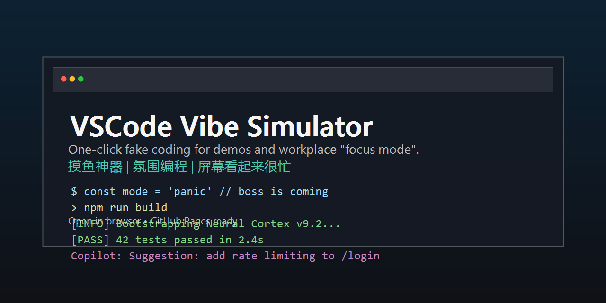

# VSCode Vibe Simulator

一个纯前端的“摸鱼神器”，一键模拟高强度编码现场：代码自动敲、终端自动跑、AI 自动回，屏幕看起来很忙但你很轻松。

- 在线体验（GitHub Pages）：https://jackro123438-crypto.github.io/VSCode_Vibe_Simulator/
- 本地运行：双击 `vibe_coding.html`



## 中文说明

### 30 秒上手

```bash
git clone <your-repo-url>
cd VSCode_Vibe_Simulator
start vibe_coding.html
```

### 你会看到什么

- VSCode 风格界面：标签页、面包屑、状态栏、缩略图
- 多语言代码场景：Rust / TypeScript / Python / Go / YAML / SQL / Prisma...
- 自动行为循环：打字、终端日志、AI 对话、搜索、调试变量、偶尔切换标签
- 适合用途：截图、短视频、直播背景、办公室氛围屏

### 传播用文案（复制即发）

- 「老板来了我已经在救火：终端在跑，AI 在回，代码在动（其实我在发呆）」
- 「开会背景不尴尬：一键 VSCode 氛围编程」
- 「屏幕看起来很忙，但我很轻松」

推荐标签：`#摸鱼神器` `#氛围编程` `#VSCode` `#程序员整活`

### 自定义与投稿

- 场景都在 `engine.js` 的 `S` 数组里，欢迎提 PR 增加“场景包”
- 模板：`scenes/SCENE_TEMPLATE.md`
- 贡献说明：`CONTRIBUTING.md`

### GitHub Pages 部署

1. 进入仓库 `Settings -> Pages`
2. Source 选择 `Deploy from a branch`
3. Branch 选择 `main`，目录选择 `/ (root)`
4. 保存后等待几分钟，访问你的 Pages 链接

### 免责声明

本项目仅用于娱乐、视觉演示和界面模拟。请遵守公司或组织规范，合理使用。

---

## English Documentation

VSCode Vibe Simulator is a frontend-only "fake coding" toy: auto-typing code, auto-running terminal logs, and auto-generating AI assistant messages inside a VSCode-like UI. Great for demos, screenshots, short videos, and workplace "focus mode".

- Live demo (GitHub Pages): https://jackro123438-crypto.github.io/VSCode_Vibe_Simulator/
- Local run: open `vibe_coding.html`

### 30-second start

```bash
git clone <your-repo-url>
cd VSCode_Vibe_Simulator
start vibe_coding.html
```

### What you get

- VSCode-like layout: tabs, breadcrumbs, status bar, minimap
- Multi-language scenes: Rust / TypeScript / Python / Go / YAML / SQL / Prisma...
- Randomized loop: typing, logs, AI chat, search, debug vars, tab switching
- Perfect for: screenshots, short-form videos, livestream backgrounds, office atmosphere screens

### Contributing

- Add more scenes in the `S` array in `engine.js`
- Template: `scenes/SCENE_TEMPLATE.md`
- Guide: `CONTRIBUTING.md`

### Deploy to GitHub Pages

1. Go to repo `Settings -> Pages`
2. Select `Deploy from a branch`
3. Pick branch `main` and folder `/ (root)`
4. Wait a few minutes, then open your Pages URL

### Disclaimer

This project is for entertainment, visual demos, and UI simulation only. Use it responsibly and follow your workplace policies.
